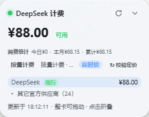

# dsh-billing-glass — 液态玻璃计费悬浮卡

[](LICENSE)
[](#)
[](#)
[](https://github.com/linkingoscar/dsh-billing-glass)

DeepSeek Harness Web GUI 的 API 计费悬浮卡插件：**液态玻璃材质**，常驻右下角
显示供应商余额，点击展开完整计费卡（本会话费用、今日消费、token 三桶占比、
多供应商列表）。**DeepSeek 优先**，架构上为后续接入其它 API 供应商留好扩展点。

[English](README.md) | 中文

> 社区第三方插件，与 DeepSeek 官方无隶属关系 · Unofficial community plugin, not affiliated with or endorsed by DeepSeek.

<p align="center">
  
  
</p>

## 功能

- **玻璃胶囊常驻**：状态点 + 供应商名 + 余额，一瞥即得，不用切窗口查余额；
  点击展开完整卡片，展开卡头部可拖动（位置存 localStorage，可拖到页面任意
  位置，底部没有空气墙）。卡片禁用横向溢出——不需要靠横向滚动条拖内容出来看。
- **即时刷新**：客户端每 10 秒轮询；DeepSeek 余额服务端缓存 TTL 10 秒
  （其它供应商 60 秒）；官方今日消费缓存 5 分钟；窗口重新聚焦、标签页切回、
  卡片展开时立即刷新；点刷新按钮走 POST 强刷当前供应商余额。
- **液态玻璃材质**：`backdrop-filter` 磨砂增艳 + 半透明主题底色 + 镜面高光描边 +
  折射光斑层 + 柔和悬浮投影；自动跟随 `--dsw-*` 亮/暗主题。
- **逐条消息费用角标**：每条 assistant 消息动作条上显示当条费用小徽章
  （悬停见输入/缓存/输出 token 拆分与模型）。
- **设置卡片**：设置面板新增「计费悬浮卡」页（Harness v0.1.0-rc.7+；更早宿主
  自动隐藏）：可关闭悬浮胶囊 / 逐条费用角标，并可一键恢复悬浮卡默认位置；
  偏好即时生效，仅保存在本机浏览器。
- **型号代称 tag**：胶囊与展开卡显示当前模型的短标签——DeepSeek
  Pro/Flash/Flash-Vision、Moonshot K2.5/K3、GPT 5.6-Sol/5.6-Terra/5.6-Luna、
  Claude Opus-4、Gemini 2.5-Pro、Qwen 3.7-Max、GLM 5.2 等；长标签自动省略，
  不撑卡。
- **消费账本与统计**：append-only JSONL 账本
  （`storages/billing-glass-ledger.jsonl`，幂等、防抖追加、定期压缩；
  旧版 `billing-glass-ledger.json` 自动迁移；启动时检测坏行/尾部残行并自动修复，
  卡片显示 degraded 警告），展开卡显示 今日 / 本月 / 累计 消费统计
  （按浏览器 IANA 时区归日，避免服务器 UTC 切错日期）。金额以 `costUsd` 为
  聚合基准，展示层按 `costNative + nativeCurrency` 显示，不再用含义模糊的
  单字段 `cost`。
- **会话费用**：对每条 `assistant/message` 按官方价格政策（带有效期，含
  2026-08-17 峰谷）计价；视觉实验模型 `deepseek-v4-flash-vision-exp`
  （Harness v0.1.1-rc.1 起提供）与 v4-flash 同价同峰谷（图片按尺寸折算
  token 计费）；live/replay 走统一 canonical attribution
  （header > source，按 messageId 去重合并）。持久化日志全量回放（包含安装前
  的历史）+ 实时账本兜底；宿主持久层不支持逐会话原始工件时自动降级为
  实时账本。悬停 ⓘ 显示「tokens × 单价 = 小计」公式。
- **历史价格快照**：每条消息首次计价时持久化单价、三类 token 小计与目录来源；
  以后回放旧会话复用原快照，升级价格目录不会静默改写历史消费。
- **未知模型 fail closed**：目录里没有的模型（catalog 落后、alias 改名、新模型）
  不会被静默按 0 元计费——该条消息标记「未计价」，卡片与消费统计显示
  `未计价 N`，账本记录 `priced: false`。
- **今日消费（仅官方口径）**：只有配置 `DEEPSEEK_PLATFORM_TOKEN` 时才显示
  “今日已消费”；未配置时不显示这一行，避免余额差估算被充值/退款混淆。
- **定价同步校验（按钮）**：展开卡「套餐」行的 **↻ 校验定价** 按钮，只拉取
  **当前显示的那家供应商**的官方定价源，验证计费体系是否最新（不批量刷新，
  避免对多家官网同时请求）：
  - DeepSeek：拉官方定价页（api-docs.deepseek.com）解析峰谷矩阵
    （flash / pro / vision-exp 三列），与内置政策链逐项对比 →
    ✅ 已同步 / ⚠ 发现差异（列明细，页面快照落盘到
    `storages/billing-glass-pricing-snapshot.html` 供助手分析）/ 无法解析（页面
    改版，引导对话求助手）。60 秒防抖。
  - 官方目录供应商（其余 24 家）：提示价格随 Harness 官方目录同步
    （`scripts/sync-providers.js`），需要立即核对时引导对话求助手。
- **多供应商自动切换**：卡片自动跟随**当前正在使用的供应商**——
  会话最近请求的 provider（`request/header`）> Harness 后台配置的现行供应商
  （设置 → 模型 的 `agent-default-model`）> 注册表第一位（DeepSeek 优先）。
  展开卡底部的供应商列表可点击手动查看某个供应商，再点一次恢复自动跟随；
  配置里现行的供应商带「现行」徽章，未配 Key 的带「未配置」标记。
- **套餐 / 费用体系**：每个供应商声明自己的 `plan`（`token` 按量计费 /
  `subscription` 订阅套餐），卡片「套餐」行显示计费方式 + 当前计价档
  （标准价 / 峰时价 / 谷时价）。若上游目录三类 token 单价全为 0，则明确
  显示为套餐额度并保持「未计价」，不再伪装成免费按量调用。

- **今日消费（官方口径，可选）**：未配置 `DEEPSEEK_PLATFORM_TOKEN` 时不显示
  这一行。配置后显示官方平台“已消费”精确值：

  1. 登录 https://platform.deepseek.com，打开 DevTools → Console，执行
     `JSON.parse(localStorage.getItem('userToken')).value`
  2. 把结果加入 `~/.dsh/.credentials.yaml`：`DEEPSEEK_PLATFORM_TOKEN: <token>`
  3. 刷新页面；卡片出现“今日已消费”官方口径。token 过期或接口失败时该行
     隐藏（不会退回余额差估算，避免统计混淆）。

## 已知限制

- **“今日消费”只显示官方口径**：未配置 `DEEPSEEK_PLATFORM_TOKEN` 时整行隐藏；
  余额差估算因充值/退款不可靠，已不再作为展示来源。
- **会话费用与消费统计是本地计价，不是供应商账单**：按插件内置的官方价格表
  与消息 token 计算，可能与平台最终账单存在微小差异（计价时点、四舍五入、
  峰谷口径等）。
- **峰谷“周一至周五”限定以 2026-08-23 官方页面为准**：官方脚注明确高峰仅限
  工作日（周末全天谷价）；2026-08-17~08-22 期间官方页面未写明该限定，回放
  统计按现行定义计算，若平台当时实际按每日峰谷结算，这几天的回放金额可能
  略低于账单。
- **消费统计只覆盖插件见过的消息**：当前会话可通过持久化日志回放安装前的
  历史；从未经插件处理过的其它历史会话不会出现在本地账本中。
- **未知模型 fail closed**：目录里没有的模型标记“未计价”而不是按 0 元计费，
  因此显示金额可能低于实际账单；需要重跑 `scripts/sync-providers.js` 或补充
  计价方案。
- **部分供应商没有公开余额接口**：余额显示“—”，但会话费用仍按目录价计算。
- **价格目录可能滞后**：非 DeepSeek 供应商价格来自 Harness 内置 pi-ai 目录
  快照；Harness 升级后需重跑 `scripts/sync-providers.js`。DeepSeek 可用
  “校验定价”按钮立即核对官方价格页。
- **DeepSeek 历史计价只覆盖已审计区间**：政策带 `[since, until]` 有效期；
  未审计空窗或已退役旧 alias（deepseek-chat/reasoner）会标记“未计价”，
  不会无限继承旧价格。
- **官方今日消费固定按北京时间日界线**（Asia/Shanghai），与宿主/服务器时区无关。
- **型号代称 tag 是启发式展示**：新模型/新命名可能识别不到或显示泛称，
  仅影响显示，不影响计费。
- **余额刷新存在延迟**：DeepSeek 余额最多 10 秒（其它供应商 60 秒），且
  供应商平台侧的余额结算本身也可能有延迟。

## 结构

```
dsh-billing-glass/
├── README.md
├── package.json              # dsh.bundle + dsh.client(web) 声明
├── cordis.patch.yml          # 组合包补丁层
├── scripts/
│   ├── build-client.js       # src/client/* → lib/client.js（用户仍无构建安装）
│   ├── sync-providers.js     # pi-ai 官方目录同步 + 数据血缘记录
├── src/client/               # 浏览器端维护源码（组件/格式/型号 tag/材质/偏好/设置卡片）
└── lib/
    ├── index.js              # host：聚合路由 /api/billing-glass/state + 事件计费
    ├── ledger.js             # append-only JSONL 消费账本
    ├── client.js             # 构建产物（不要手改，改 src/client 后跑 build）
    └── providers/
        ├── registry.js       # provider 抽象与注册表（扩展点）
        ├── deepseek.js       # DeepSeek provider（余额/今日消费/计价）
        ├── deepseek-pricing.js # DeepSeek 官方价格引擎（政策链 + 峰谷）
        └── catalog.generated.js # pi-ai 目录快照 + PI_AI_CATALOG_META 血缘
```

## 安装

从 GitHub 安装（推荐）：

```sh
dsh plugin --profile web add github:linkingoscar/dsh-billing-glass
```

本地 checkout（开发用）：

```sh
dsh plugin --profile web add link:$(pwd)
```

然后重启 `dsh web` 并刷新页面。要求 Harness 支持 `dsh plugin` 命令，且已在
**设置 → 模型** 配置 `DEEPSEEK_API_KEY`（余额查询复用这把 Key，不出本机）。

## 安全与信任边界

- dsh v0.1.2+ 下所有插件路由复用宿主连接的 launch-token 与 Host/Origin 校验；
  v0.1.1 兼容回退仍沿用旧信任边界，因此应让 Harness `webServer` 仅绑定本机或置于
  宿主认证之后。
- `GET /api/billing-glass/state` 与 `GET /api/billing-glass/ledger` 只读
  （余额/今日消费的外部请求有 TTL 缓存，不会被 UI 轮询无限放大）。
- 有副作用的路由是 **POST**：`/api/billing-glass/refresh-balance`（强刷供应商余额）
  和 `/api/billing-glass/refresh-pricing`（拉官方定价页并可能写快照）。
- DeepSeek 平台 token 只由 host 本机用于 platform.deepseek.com 内部接口，
  且今日消费缓存 5 分钟。

## 接入新的 API 供应商

**预置范围与 Harness 官方提供方列表完全对齐（无感）：**

- 注册表内置 **27 家供应商**（`lib/providers/catalog.generated.js`），由
  `scripts/sync-providers.js` 从 Harness 内置的 pi-ai 官方目录自动生成——
  名称、baseURL、每个模型的官方价格（USD/1M）都与 Harness 模型配置后台
  的提供方列表一致。在设置 → 模型 里选了谁、会话用了谁，悬浮卡自动切换。
- 其中 DeepSeek 用专用 provider（峰谷政策链精确计价），Moonshot /
  OpenRouter 另有公开余额接口适配；其余供应商会话费用计价照常，
  余额显示「无公开余额接口」。
- Harness 升级后重跑 `node scripts/sync-providers.js` 即同步最新目录与价格。
- 数据血缘可审计：`catalog.generated.js` 同时导出 `PI_AI_CATALOG_META`
  （source / sourceVersion / sourceSha256 / generatedAt），由 sync 脚本自动写入，
  并由 CI 强制校验非 null。

**官方列表之外的自定义供应商（优雅降级 + 引导闭环）：**

会话使用了 Harness 官方目录未列举的供应商（baseURL 匹配失败）时，悬浮卡
出现 ⚠ 引导条：

> 未识别的供应商 "xxx"：不在 Harness 官方提供方列表中。请在对话中告诉
> 助手它的计价方案（单价/套餐）或官方价格页链接，助手会帮你完成配置。

用户按提示在对话里给出计价方案后，即可用通用工厂
`defineOpenAiCompatProvider`（`lib/providers/openai-compat.js`）一次性接入，
之后同样永久自动。

1. 新建 `lib/providers/<vendor>.js`，实现 provider 契约（见 `registry.js` 顶部注释）：

   ```js
   export const myVendor = {
     id: "my-vendor",
     displayName: "My Vendor",
     currency: "USD",
     aliases: ["my-vendor-official"],   // Harness provider id 别名（header/配置里出现的名字）
     defaultModel: "my-model",
     keyRef: "MY_VENDOR_API_KEY",       // 凭证引用名（判断是否已配置 Key）
     plan: { kind: "token", label: "按量计费 · 官方价格" },
     // 订阅制供应商：
     // plan: { kind: "subscription", label: "Pro 套餐", fee: 20, currency: "USD", period: "月" },
     async fetchBalance(ctx) { /* 返回 { total, granted, toppedUp, available, currency } */ },
     // 模型无价且无 `*` 兜底时必须返回 null（fail closed）
     priceAt(model, timeMs) { /* 返回 { cny, usd, mode } 单价，或 null */ },
     // costNative 是供应商原生币种金额，costUsd 是聚合基准
     costOf(usage, unit) { /* 返回 { costNative, nativeCurrency, costUsd, ...tokens } */ },
     async todayConsumed(ctx, config, balance) { /* 可选，返回 number | null */ }
   };
   ```

2. 在 `registry.js` 的 `PROVIDERS` 数组注册（顺序即悬浮卡展示顺序，DeepSeek 保持第一）。
3. 在 Harness 设置 → 模型 里选择该供应商/模型，或发起一次使用该供应商的请求——
   悬浮卡即自动切换显示它的名称、套餐与费用体系。
4. 重启 `dsh web` 即生效——UI 与聚合路由自动多出一节，无需改动。

## 供应商切换信号（自动感知）

| 信号 | 来源 | 优先级 |
| --- | --- | --- |
| 会话实际使用的供应商 | `request/header` 事件（provider id 或 pi-ai 网关 baseURL） | 最高 |
| 后台配置的现行供应商 | `ctx.agentDefaultModel.currentSelection()`（设置 → 模型） | 次之 |
| 注册表默认（DeepSeek） | `PROVIDERS[0]` | 兜底 |

供应商 id 通过 `aliases` 归一（如 Harness 里 DeepSeek 的 provider id 是
`deepseek-official`）；pi-ai 网关按 baseURL hostname 匹配（`baseUrlHosts`，
如 `api.moonshot.cn` → Moonshot Kimi），未知 baseURL 不误配。

## 验证

```sh
npm ci                               # 锁定 devDependency（pi-ai 目录同步用）
npm test                             # 单元 + 渲染冒烟 + state 路由集成
npm run check:generated              # 重建 client bundle + 重跑 catalog sync，并 git diff 校验
npm run pack:check                   # 发布包内容校验
dsh --profile web --dump-config        # 组合树校验（bundle 行出现）
# 真机：重启 dsh web，页面右下角出现玻璃胶囊
```

CI（`.github/workflows/ci.yml`）会对每个 push/PR 执行同样的门禁。
## License

[Apache-2.0](LICENSE) © 2026 [linkingoscar](https://github.com/linkingoscar)

定价引擎移植自 [bpc-oss/dsh-web-billing](https://github.com/bpc-oss/dsh-web-billing)
（MIT 许可），其版权声明按 MIT 要求保留在
[THIRD_PARTY_NOTICES.md](THIRD_PARTY_NOTICES.md)。
